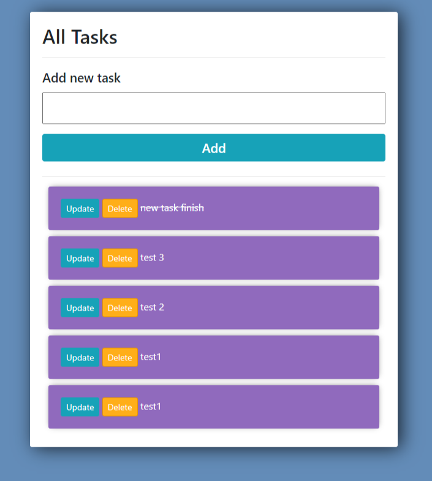

# Deploying a Django simple todo list

This is the project starter repo for the course To Do App for [Dennis](https://youtu.be/4RWFvXDUmjo), on Youtube channel, and modified by me.

In this project you can do the simple CRED with Django.

- `GET '/'`: This Will Get all the tasks you have created.
- `POST'/'`: This the data and create a new Task.
- `update '/<pk>'`: This will update the Task.
- `delete'/<pk>`: This endpoint will dlelet the Task.

# Home Page

# Update Task

# Delete Task

## Initial setup

1. Fork this project to your Github account.
2. Locally clone your forked version to begin working on the project.

# Tests

### To run tests just type in command

`python manage.py test`

# Seed database:

### To seed the database with dummy data just run:

`python manage.py seed_db`
